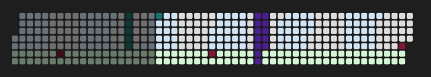

# Daytiles for Obsidian

Render [daytiles](https://github.com/Chamartin3/daytiles) SVG calendars
directly inside your notes from fenced code blocks. Configure layouts, shapes,
and colors declaratively, drop events inline, or pull them live from a
[Dataview](https://github.com/blacksmithgu/obsidian-dataview) query.



## Features

- Drop-in ` ```daytiles ` code block — renders to inline SVG.
- Layouts: month, week, weekday (GitHub-style heatmap), custom days-per-row.
- Tile shapes: rect, rounded, circle, diamond.
- Inline events, alternation bands, weekday/month highlights, fade for
  past/future days.
- Optional Dataview source — pull events from any DQL `TABLE` query.
- Click a tile with a `wiki:` field to open that internal link.
- Settings tab for global defaults; per-block options override them.
- Works on desktop and mobile (no Node-only APIs).

## Install

### Manual install (until listed in the community browser)

1. Download `main.js`, `manifest.json`, and `styles.css` from the latest
   [release](https://github.com/Chamartin3/obsidian-daytiles/releases).
2. Copy them into `<your-vault>/.obsidian/plugins/daytiles/`.
3. Open **Settings → Community plugins**, refresh, and enable **Daytiles**.

### BRAT

If you use [BRAT](https://github.com/TfTHacker/obsidian42-brat), add
`Chamartin3/obsidian-daytiles` as a beta plugin.

## Quick start

````markdown
```daytiles
layout: month
startDate: 2026-01-01
endDate: 2026-12-31
events:
  - { start: 2026-03-15, note: Launch }
  - { start: 2026-07-01, end: 2026-07-14, type: vacation }
```
````

## Options

### Layout

| Key              | Default      | Notes                                  |
| ---------------- | ------------ | -------------------------------------- |
| `layout`         | `month`      | `month` \| `week` \| `weekday` \| `custom` |
| `startDate`      | year start   | ISO date                               |
| `endDate`        | year end     | ISO date                               |
| `daysPerRow`     | `21`         | only for `layout: custom`              |
| `startDayOfWeek` | `1`          | `0` = Sunday, `1` = Monday             |
| `showLabels`     | `false`      | render row labels                      |
| `labelWidth`     | `56`         | px reserved for labels                 |

### Tile sizing & shape

| Key       | Default | Notes                                          |
| --------- | ------- | ---------------------------------------------- |
| `daySize` | `16`    | tile edge in px                                |
| `gap`     | `4`     | spacing between tiles                          |
| `shape`   | `rect`  | `rect` \| `rounded` \| `circle` \| `diamond`  |

### Colors

```yaml
colors:
  current: "#FFD700"
  dayColor: "#eee"
  pastFade: 0.6
  futureFade: 1
  highlightCurrent: true
  defaultEventColor: "#ff5577"
  eventTypeColors:
    work: "#3c3b6e"
    vacation: "#34c759"
  alternation:
    mode: month        # none | day | week | month | year | custom
    color: "#d2f0fa"
    size: 7            # only for mode: custom
  highlight:
    weekdays: { 0: "#fee", 6: "#fee" }
    months:   { 11: "#fef" }
```

### Inline events

```yaml
events:
  - { start: 2026-03-15, color: "#f55", note: Launch }
  - { start: 2026-04-01, end: 2026-04-07, type: vacation }
  - { start: 2026-05-20, note: Demo, wiki: "Demos/Demo May" }
```

If `wiki` is set, clicking the tile opens that internal link.

### Dataview source

Requires the Dataview plugin to be installed and enabled.

```yaml
events:
  source: dataview
  query: |
    TABLE WITHOUT ID file.day AS start, color, type, note
    FROM "Journal"
    WHERE date
  fields:
    start: start
    color: color
    type: type
    note: note
```

The `fields` map renames result headers into daytiles event fields. `start` is
required; the rest are optional.

## Examples vault — copy-paste presets

The `examples-vault/` folder in this repo is a self-contained Obsidian vault
full of ready-made blocks you can drop straight into your own notes. Every
layout, shape, event style, heatmap, action link, and Dataview source is in
there as a working block — open it, copy the one that matches what you want,
paste it into your vault, and tweak from there.

What's inside:

- `Daytiles-Showcase.md` — the catalog of presets, grouped by layout, shape,
  and event source.
- `Journal/` — sample daily notes with frontmatter so the Dataview presets
  return real results.
- `.obsidian/community-plugins.json` pre-configured to enable Daytiles and
  Dataview.

To open it:

1. Build the plugin (`npm run build`).
2. Copy or symlink `dist/` into `examples-vault/.obsidian/plugins/daytiles/`.
3. Open `examples-vault/` in Obsidian and trust the vault.
4. Open `Daytiles-Showcase.md` and start copying blocks.

## Settings

A **Daytiles** settings tab provides defaults that every code block inherits
(per-block keys still win):

- Block background, label text color, day tile color, today-highlight, default
  event color.
- Day size, gap, start day of week, show-labels toggle.
- Past/future fade.
- Alternation mode, color, size.
- Theme mode (auto / light / dark).
- Enable/disable the Dataview event source.

## Development

```sh
npm install
npm run dev      # esbuild watch -> dist/
npm run build    # production bundle
npm test         # jest + jsdom render tests
```

Symlink the build output into a test vault for hot reloading:

```sh
ln -s "$(pwd)/dist" /path/to/vault/.obsidian/plugins/daytiles
```

The community plugin
[Hot-Reload](https://github.com/pjeby/hot-reload) picks up `main.js` changes
without a restart.

## Credits

Built on top of [daytiles](https://github.com/Chamartin3/daytiles) — the
dependency-free SVG calendar library doing the actual rendering.

## License

[MIT](./LICENSE)
