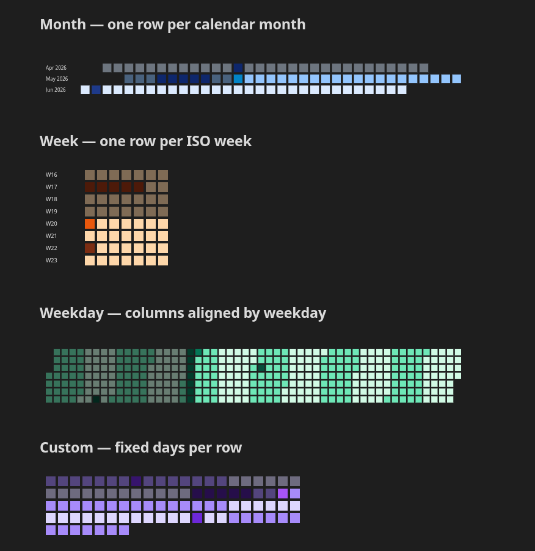

# Daytiles for Obsidian

Render [daytiles](https://github.com/Chamartin3/daytiles) SVG calendars
directly inside your notes from fenced code blocks. Configure layouts, shapes,
and colors declaratively, drop events inline, or pull them live from a
[Dataview](https://github.com/blacksmithgu/obsidian-dataview) query.


## Features

- Drop-in ` ```daytiles ` code block — renders to inline SVG.
- Layouts: month, week, weekday (GitHub-style heatmap), custom days-per-row.
- Tile shapes: rect, rounded, circle, diamond.
- Inline events, alternation bands, weekday/month highlights, fade for
  past/future days.
- Optional Dataview source — pull events from any DQL `TABLE` query.
- Click a tile with a `wiki:` field to open that internal link.
- Settings tab for global defaults; per-block options override them.
- Works on desktop and mobile (no Node-only APIs).

## Install

### Manual install

1. Download `main.js`, `manifest.json`, and `styles.css` from the latest
   [release](https://github.com/Chamartin3/obsidian-daytiles/releases).
2. Copy them into `<your-vault>/.obsidian/plugins/daytiles/`.
3. Open **Settings → Community plugins**, refresh, and enable **Daytiles**.

### BRAT

If you use [BRAT](https://github.com/TfTHacker/obsidian42-brat), add
`Chamartin3/obsidian-daytiles` as a beta plugin.

## Quick start

````markdown
```daytiles
layout: month
startDate: 2026-01-01
endDate: 2026-12-31
events:
  - { start: 2026-03-15, note: Launch }
  - { start: 2026-07-01, end: 2026-07-14, type: vacation }
```
````

## Options

### Display — layout, sizing, shape

How days are arranged on screen.



| Key              | Default    | Notes                                            |
| ---------------- | ---------- | ------------------------------------------------ |
| `layout`         | `month`    | `month` \| `week` \| `weekday` \| `custom`       |
| `startDate`      | year start | ISO date                                         |
| `endDate`        | year end   | ISO date                                         |
| `daysPerRow`     | `21`       | only for `layout: custom`                        |
| `startDayOfWeek` | `1`        | `0` = Sunday, `1` = Monday                       |
| `showLabels`     | `false`    | render row labels                                |
| `labelWidth`     | `56`       | px reserved for labels                           |
| `daySize`        | `16`       | tile edge in px                                  |
| `gap`            | `4`        | spacing between tiles                            |
| `shape`          | `rect`     | `rect` \| `rounded` \| `circle` \| `diamond`     |

### Theming — colors and highlights

How the tiles are tinted. Every color key lives under `colors:`.

```yaml
colors:
  dayColor: "#eee"           # base tile color
  current: "#FFD700"         # today's tile
  highlightCurrent: true
  pastFade: 0.6              # opacity for past days
  futureFade: 1              # opacity for future days
  defaultEventColor: "#ff5577"
  alternation:               # banded background by day / week / month / year
    mode: month              # none | day | week | month | year | custom
    color: "#d2f0fa"
    size: 7                  # only for mode: custom
  highlight:                 # paint specific weekdays or months
    weekdays: { 0: "#fee", 6: "#fee" }
    months:   { 11: "#fef" }
  heatmap: false             # tint tiles by accumulated event weight
  heatmapLow: 0.2
  heatmapHigh: 0.75
```

### Events — inline, types, sources, click actions

What gets drawn on top of the tiles.

**Inline events.** Each entry needs a `start`; everything else is optional.

```yaml
events:
  - { start: 2026-03-15, note: Launch }
  - { start: 2026-04-01, end: 2026-04-07, type: vacation }
  - { start: 2026-05-20, type: demo, note: Demo, vault_link: "Demos/Demo May" }
```

**Event types.** Events don't carry hex colors — they carry a `type`, and the
type is looked up in `colors.eventTypeColors`:

```yaml
colors:
  eventTypeColors:
    work:     "#3c3b6e"
    vacation: "#34c759"
```

Untyped events fall back to `colors.defaultEventColor`.

**Dataview source.** Pull events from any DQL `TABLE` query. Requires the
Dataview plugin.

```yaml
events:
  source: dataview
  query: |
    TABLE WITHOUT ID file.day AS start, type, note
    FROM "Journal"
    WHERE date
  fields:
    start: start
    type:  type
    note:  note
```

`fields` maps Dataview column names to event keys. Only `start` is required.

**Click actions.** Events can carry a link target. Clicking the tile opens it.

| Field        | Opens                                                 |
| ------------ | ----------------------------------------------------- |
| `vault_link` | a note in this vault (`[[wiki link]]` syntax, with `#heading` supported) |
| `url`        | an external URL in the browser                        |

If both are set, `url` wins.

## Examples vault

See [`examples-vault/`](examples-vault) for a ready-to-open Obsidian vault
with working presets for every layout, shape, theming variation, and event
source — copy any block straight into your own notes.

## Settings

A **Daytiles** settings tab provides defaults that every code block inherits
(per-block keys still win):

- Block background, label text color, day tile color, today-highlight, default
  event color.
- Day size, gap, start day of week, show-labels toggle.
- Past/future fade.
- Alternation mode, color, size.
- Theme mode (auto / light / dark).
- Enable/disable the Dataview event source.

## Development

```sh
npm install
npm run dev      # esbuild watch -> dist/
npm run build    # production bundle
npm test         # jest + jsdom render tests
```

Symlink the build output into a test vault for hot reloading:

```sh
ln -s "$(pwd)/dist" /path/to/vault/.obsidian/plugins/daytiles
```

The community plugin
[Hot-Reload](https://github.com/pjeby/hot-reload) picks up `main.js` changes
without a restart.

## Credits

Built on top of [daytiles](https://github.com/Chamartin3/daytiles) — the
dependency-free SVG calendar library doing the actual rendering.

## License

[MIT](./LICENSE)
